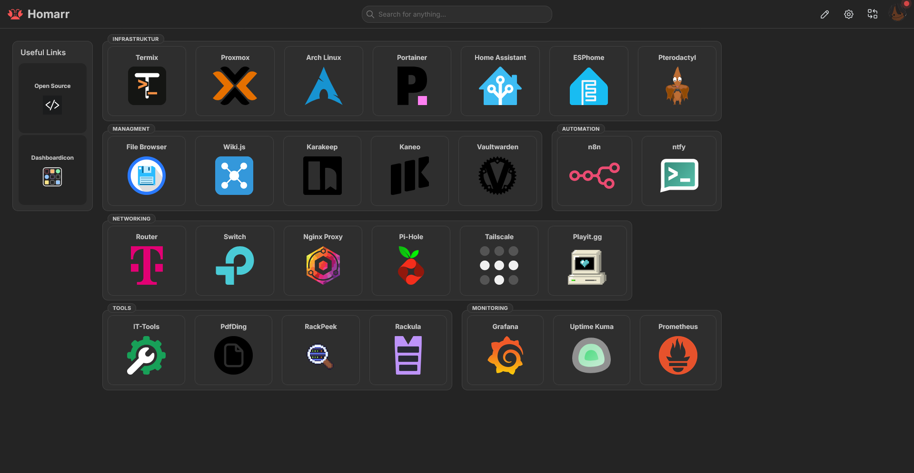
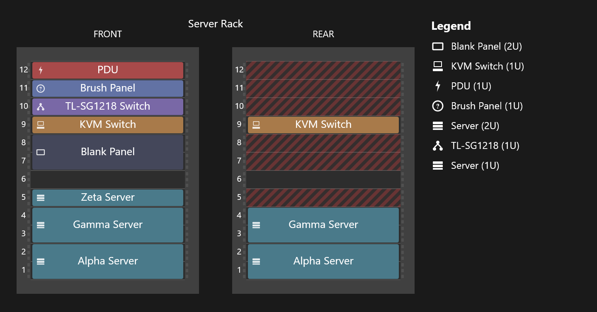
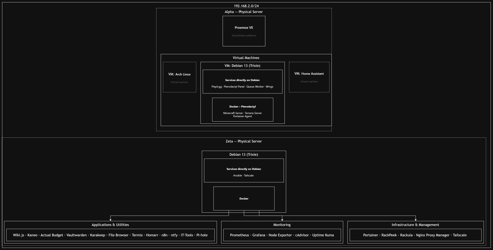
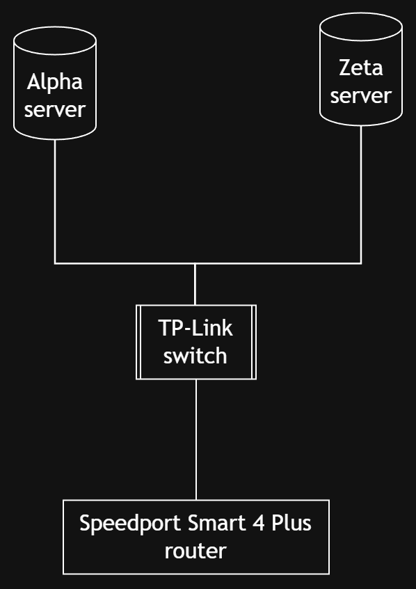
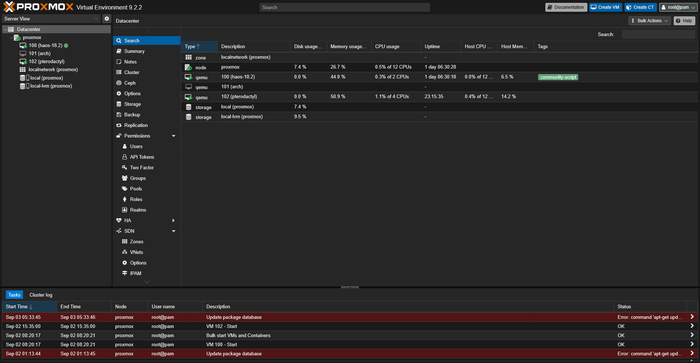
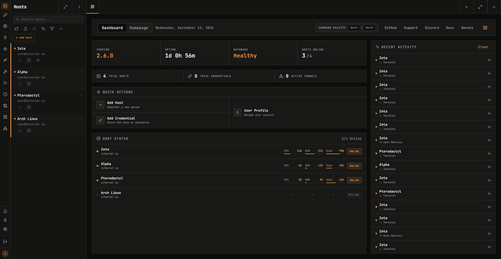
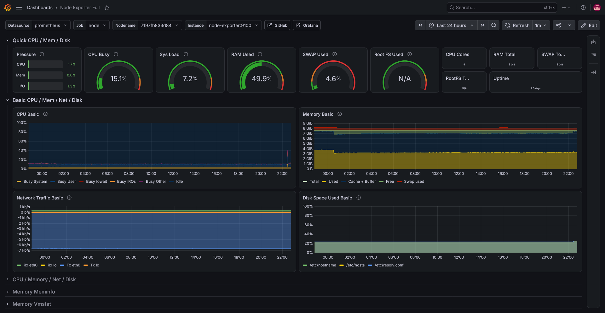
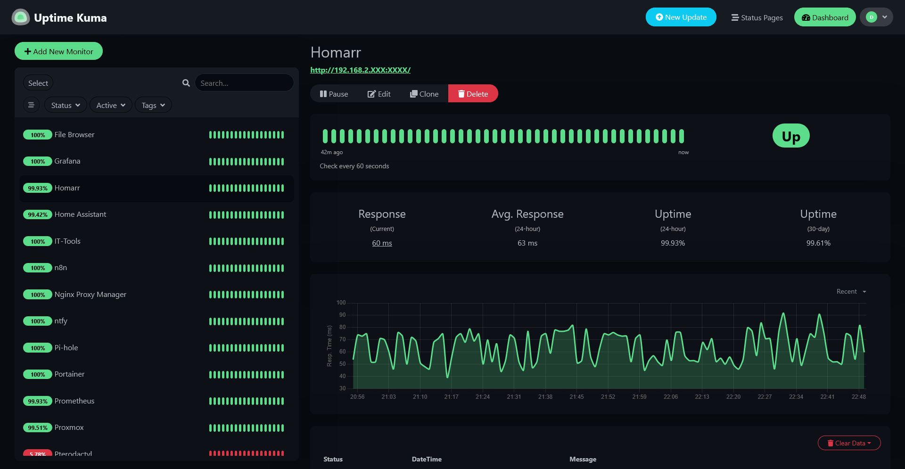
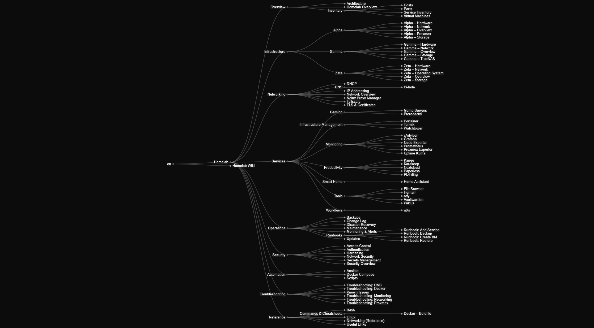

# Homelab-Infrastruktur

[🇬🇧 English version](README.en.md)

Self-hosted, mehrstufige Serverinfrastruktur für Netzwerkdienste, Monitoring,
Automatisierung und Virtualisierung. Als persönliches Projekt parallel zu meinem
Informatikstudium aufgebaut und betrieben (Schwerpunkt: Technische Systeme).

*Zentrales Dashboard für den schnellen Zugriff auf alle laufenden Dienste*

## Praktische Erfahrungen

Durch den Betrieb dieser Infrastruktur konnte ich praktische Erfahrungen in folgenden Bereichen sammeln:

- Linux-Systemadministration
- Docker und Verwaltung von Container-Lebenszyklen
- Virtuelle Maschinen und virtuelle Netzwerke
- DNS, DHCP und Reverse Proxies
- VPN-basierter Fernzugriff
- Monitoring und Observability
- Infrastrukturautomatisierung mit Ansible
- Fehleranalyse anhand von Logs und systemweiten Diagnosewerkzeugen
- Technische Dokumentation

## Motivation

Ich habe dieses Homelab als praxisnahe Umgebung aufgebaut, um Inhalte aus meinem
Informatikstudium anzuwenden und praktische Erfahrungen mit Linux, Netzwerken,
Virtualisierung, Automatisierung, Monitoring und selbst gehosteten Diensten zu sammeln.

Die Infrastruktur dient sowohl als Lernumgebung als auch als praktische IT-Plattform
für den Betrieb von Diensten wie Home Assistant, Gameservern, Monitoring und internen
Tools. Der laufende Betrieb bietet außerdem die Möglichkeit, reale technische Probleme
zu analysieren, Lösungen zu bewerten und die Ergebnisse zu dokumentieren.

## Übersicht

Die Infrastruktur besteht aus zwei derzeit betriebenen physischen Hosts. Ein dritter
Host ist geplant, um die Umgebung um dedizierte Speicher- und Backup-Funktionen zu erweitern:

| Host | Status | Rolle | Plattform | Zentrale Technologien |
|---|---|---|---|---|
| **Zeta** | Running | Netzwerk- und Service-Infrastruktur | Debian 13 | Docker, Prometheus, Grafana, NPM |
| **Alpha** | Running | Virtualisierung und Compute | Proxmox VE | VMs, Docker, Home Assistant, Pterodactyl |
| **Gamma** | **Planned** | Storage und Backup | TrueNAS SCALE | ZFS, SMB/NFS |

*Physisches Rack-Layout, verwaltet mit [Rackula](https://github.com/RackulaLives/Rackula)*

## Architektur

Die Architektur der Infrastruktur wird mit RackPeek dokumentiert und visualisiert.
Sie umfasst die physische Hardware, Betriebssysteme, Virtualisierungsschicht,
Container, Dienste und deren Beziehungen untereinander.

*Logische Architektur mit den Beziehungen zwischen Hardware, Systemen, Containern und Diensten.*

*Netzwerktopologie mit den Verbindungen zwischen Infrastrukturkomponenten und Netzwerkdiensten.*

*Proxmox-Übersicht mit virtuellen Maschinen für Home Assistant, Pterodactyl und eine isolierte Arch-Linux-Lernumgebung.*

## Technologien & Kompetenzen

| Bereich | Technologien |
|---|---|
| Betriebssysteme | Debian, Linux |
| Virtualisierung | Proxmox VE |
| Container | Docker, Docker Compose |
| Netzwerk | TCP/IP, DNS, DHCP, Tailscale, Nginx Proxy Manager |
| Monitoring | Prometheus, Grafana, Node Exporter, cAdvisor, Uptime Kuma |
| Automatisierung | Ansible, n8n, Watchtower |
| Sicherheit | Tailscale, TLS, mkcert, Netzwerksegmentierung |
| Dokumentation | Wiki.js, RackPeek, Rackula |

## Kernkomponenten

### Infrastrukturverwaltung

Termix bietet eine zentrale Oberfläche zur Verwaltung und zum Zugriff auf die
Linux-Systeme der Infrastruktur über SSH. Dadurch lassen sich die Erreichbarkeit
und Ressourcennutzung mehrerer Systeme zentral überwachen.

*Zentrale Verwaltung und Überwachung der Infrastruktur-Hosts.*

### Monitoring

Prometheus sammelt Metriken von allen Hosts (Node Exporter, cAdvisor sowie einem
spezialisierten Proxmox-Exporter für VM- und Cluster-Metriken). Grafana visualisiert
die Daten in mehreren Dashboards. Zusätzlich überwacht Uptime Kuma die Verfügbarkeit
der Webdienste und versendet Benachrichtigungen über ntfy.

 

*Links: Grafana Node-Exporter-Dashboard (CPU/RAM/Netzwerk pro Host) · Rechts: Uptime-Kuma-Übersicht der überwachten Dienste*

### Netzwerk & Zugriff

Alle Dienste sind über lesbare lokale Domains (`*.homelab.com`) erreichbar und
werden über Nginx Proxy Manager bereitgestellt. Für interne Webdienste wird ein lokal vertrauenswürdiges Wildcard-Zertifikat mit mkcert verwendet. Die Zertifikate sind nicht für öffentliche Internetdienste vorgesehen, anstatt direkt über
IP-Adressen und Ports auf die Dienste zuzugreifen.

Der Fernzugriff erfolgt ausschließlich über Tailscale (Mesh-VPN). Auf direkte
Portweiterleitungen am Router wird bewusst verzichtet, um die öffentlich erreichbare
Angriffsfläche zu minimieren.

### Automatisierung

Ansible automatisiert wiederholbare Einrichtungsschritte, beispielsweise die
Installation von Docker auf neuen Hosts, über SSH und ohne Agent auf den Zielsystemen.

n8n verbindet Monitoring-Ereignisse mit automatisierten Benachrichtigungs-Workflows.

### Dokumentation

Die vollständige Infrastrukturdokumentation wird in Wiki.js gepflegt und automatisch
über die integrierte Git-Speicherfunktion von Wiki.js mit einem separaten Git-Repository
synchronisiert. Dadurch werden Änderungen versioniert und nachvollziehbar dokumentiert.

*Wiki.js-Ansicht der verknüpften Seiten und ihrer Beziehungen.*

## Herausforderungen & Lösungen

Eine Auswahl realer Probleme, die beim Betrieb der Infrastruktur aufgetreten sind.

### DNS-Konflikt durch Tailscale

Tailscales MagicDNS veränderte die DNS-Konfiguration des Hosts, wodurch Docker-Container
externe Domains nicht mehr auflösen konnten. Ich analysierte das Problem sowohl auf
Host- als auch auf Container-Ebene und behob es durch die Konfiguration eines unabhängigen
DNS-Resolvers für Docker.

### Datenverlust durch automatische Container-Updates

Ein Container verlor nach einem Watchtower-Update seine Konfiguration, da sein
Datenverzeichnis nicht korrekt persistent eingebunden war. Ich identifizierte die
fehlende Volume-Zuordnung, korrigierte die Deployment-Konfiguration und schloss
kritische Dienste von automatischen Updates aus.

### Netzwerkverbindung einer Proxmox-VM

Eine VM konnte trotz korrekt konfigurierter virtueller Bridge wiederholt keine
DHCP-Lease beziehen. Durch Netzwerkdiagnosen auf dem Proxmox-Host konnte ich das
Problem auf die physische Netzwerkkonfiguration eingrenzen, die als Ursache identifiziert wurde.

## Sicherheit

Sicherheitsaspekte werden als Bestandteil des Infrastrukturdesigns berücksichtigt:

- Keine direkten Portweiterleitungen ins öffentliche Internet
- Fernzugriff über Tailscale
- TLS für interne Webdienste
- Isolation von Diensten durch dedizierte virtuelle Maschinen, sofern sinnvoll
- Separate Zugangsdaten für Dienste
- Begrenzte Freigabe von Diensten über den Reverse Proxy
- Selektiv aktivierte automatische Updates statt uneingeschränktes automatisches Aktualisieren

## Roadmap

### Gamma — Storage- & Backup-Server

**Status:** Planung

Geplante Funktionen:

- Redundanter Speicher auf Basis von ZFS
- Automatisierte Snapshots
- SMB/NFS-Netzwerkfreigaben
- Zentrale Backups
- Dokumenten- und Medienverwaltung
- Integration in das bestehende Monitoring
